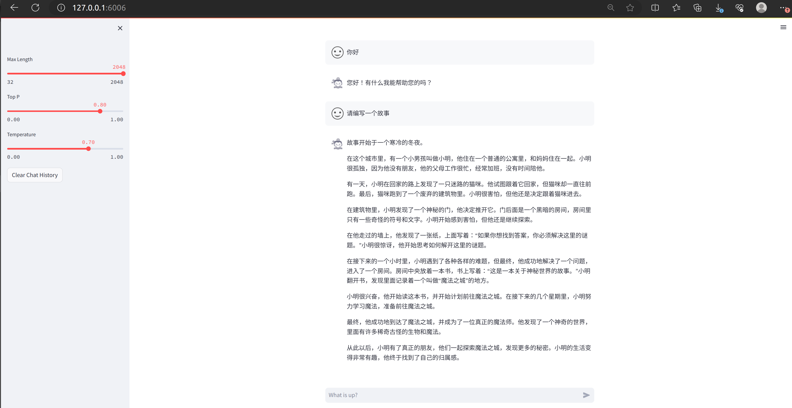
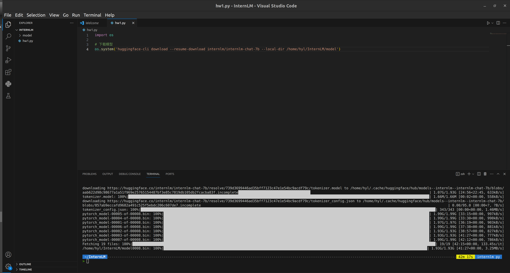
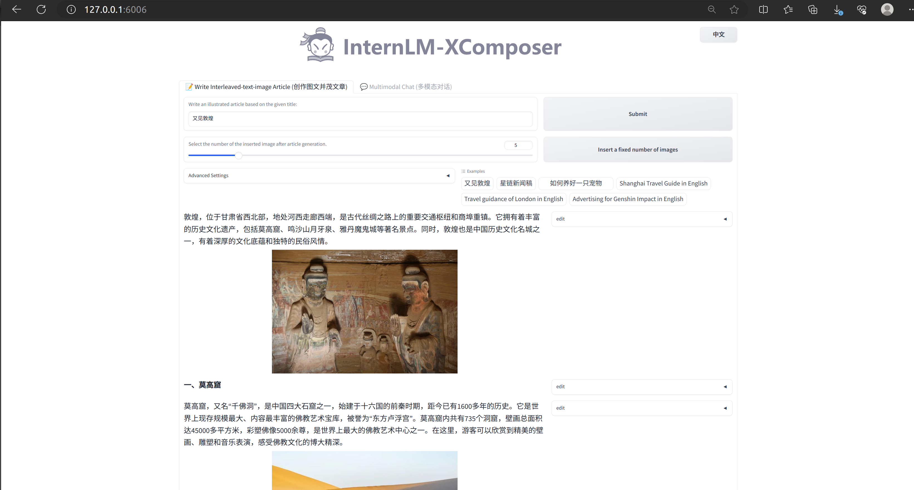
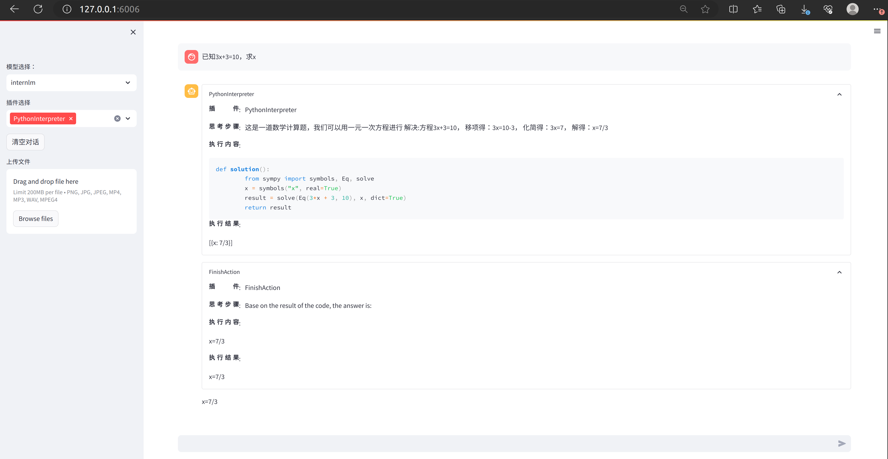

# 轻松分钟玩转书生·浦语大模型趣味 Demo

[TOC]

## 1. 基础作业

### 作业1

使用 InternLM-Chat-7B 模型生成 300 字的小故事

### 作业2

熟悉 hugging face 下载功能，使用 `huggingface_hub` python 包，下载 `InternLM-20B` 的 config.json 文件到本地（需截图下载过程）

## 2. 进阶作业

### 作业3

完成浦语·灵笔的图文理解及创作部署

### 作业4

完成 Lagent 工具调用 Demo 创作部署

